# Dependency Tree for Apollo11Model.sysml

## Legend

- **Apollo 11 Model** (subgraph, blue gradient) - Core domain packages with depth-based coloring (dark blue = root, light blue = deeper)
- **Platform Services & Utilities** (subgraph, gray) - Packages that ONLY depend on SysML V2 standards
- **Foundation / Libraries** (subgraph, light cyan) - SysML V2 standard libraries
- Solid arrows → - Core domain dependencies between Apollo 11 packages
- Dashed arrows -.-> - Dependencies on foundation and library packages

---

## Dependency Graph (Mermaid)

```mermaid
flowchart LR
  %% Clusters
  subgraph Model["Apollo 11 Model"]
    AnalysisPackage
    Apollo11MissionExecutionPackage
    Apollo11Model
    AstronautsPackage
    CalculationsPackage
    CapabilitiesPackage
    CoSMAPackage
    ContextPackage
    FunctionSpecificationPackage
    FunctionalRequirementsPackage
    FunctionsPackage
    LogicalComponentsPackage
    MissionPackage
    MissionPhasesPackage
    MissionRequirementsPackage
    MissionSpecificationPackage
    OperationsPackage
    ProgramPackage
    StakeholderNeedsPackage
    StakeholderPackage
    SystemPackage
    SystemSpecificationPackage
    TechnicalComponentsPackage
    TechnicalIndividualsPackage
    TechnicalRequirementsPackage
  end
  subgraph Utilities["Platform Services & Utilities"]
    CoSMAQuantitiesAndUnitsPackage
    CoSMAViewsPackage
    TechnicalPortsPackage
  end
  subgraph Foundation["Foundation / Libraries"]
    NumericalFunctions
    ScalarFunctions
    CollectionFunctions
    ControlFunctions
    Metaobjects
    States
    Parts
    OccurrenceFunctions
    ISQ
    SI
    USCustomaryUnits
    MeasurementReferences
    Quantities
    ScalarValues
    Time
    ModelingMetadata
    ShapeItems
  end

  Apollo11Model --> AnalysisPackage;
  AnalysisPackage -.-> SI;
  AnalysisPackage --> CoSMAQuantitiesAndUnitsPackage;
  CoSMAQuantitiesAndUnitsPackage -.-> SI;
  CoSMAQuantitiesAndUnitsPackage -.-> NumericalFunctions;
  CoSMAQuantitiesAndUnitsPackage -.-> MeasurementReferences;
  CoSMAQuantitiesAndUnitsPackage -.-> ISQ;
  CoSMAQuantitiesAndUnitsPackage -.-> Quantities;
  AnalysisPackage --> CoSMAPackage;
  CoSMAPackage -.-> SI;
  CoSMAPackage -.-> NumericalFunctions;
  CoSMAPackage -.-> MeasurementReferences;
  CoSMAPackage --> CoSMAQuantitiesAndUnitsPackage;
  CoSMAPackage -.-> States;
  CoSMAPackage -.-> ISQ;
  CoSMAPackage -.-> Metaobjects;
  CoSMAPackage -.-> Quantities;
  AnalysisPackage --> Apollo11MissionExecutionPackage;
  Apollo11MissionExecutionPackage -.-> ScalarValues;
  Apollo11MissionExecutionPackage -.-> SI;
  Apollo11MissionExecutionPackage --> FunctionsPackage;
  FunctionsPackage -.-> ScalarValues;
  FunctionsPackage --> MissionPhasesPackage;
  MissionPhasesPackage --> CoSMAPackage;
  MissionPhasesPackage --> OperationsPackage;
  OperationsPackage --> CoSMAPackage;
  FunctionsPackage --> MissionRequirementsPackage;
  MissionRequirementsPackage -.-> ScalarValues;
  MissionRequirementsPackage -.-> SI;
  MissionRequirementsPackage --> CoSMAQuantitiesAndUnitsPackage;
  MissionRequirementsPackage --> CoSMAPackage;
  MissionRequirementsPackage -.-> USCustomaryUnits;
  MissionRequirementsPackage -.-> ISQ;
  MissionRequirementsPackage -.-> ModelingMetadata;
  FunctionsPackage --> CoSMAPackage;
  FunctionsPackage -.-> ModelingMetadata;
  Apollo11MissionExecutionPackage --> CoSMAQuantitiesAndUnitsPackage;
  Apollo11MissionExecutionPackage --> AstronautsPackage;
  AstronautsPackage -.-> ScalarValues;
  AstronautsPackage --> CoSMAPackage;
  AstronautsPackage -.-> Time;
  Apollo11MissionExecutionPackage --> TechnicalComponentsPackage;
  TechnicalComponentsPackage -.-> SI;
  TechnicalComponentsPackage --> LogicalComponentsPackage;
  LogicalComponentsPackage --> CoSMAPackage;
  LogicalComponentsPackage --> FunctionsPackage;
  TechnicalComponentsPackage --> CoSMAQuantitiesAndUnitsPackage;
  TechnicalComponentsPackage --> CoSMAPackage;
  TechnicalComponentsPackage -.-> ShapeItems;
  TechnicalComponentsPackage --> TechnicalPortsPackage;
  TechnicalPortsPackage -.-> SI;
  TechnicalPortsPackage -.-> ISQ;
  Apollo11MissionExecutionPackage --> MissionPackage;
  MissionPackage -.-> SI;
  MissionPackage --> MissionPhasesPackage;
  MissionPackage --> FunctionsPackage;
  MissionPackage --> CoSMAQuantitiesAndUnitsPackage;
  MissionPackage --> CoSMAPackage;
  MissionPackage --> AstronautsPackage;
  MissionPackage -.-> ISQ;
  MissionPackage --> SystemPackage;
  SystemPackage --> TechnicalIndividualsPackage;
  TechnicalIndividualsPackage --> TechnicalComponentsPackage;
  SystemPackage --> CoSMAPackage;
  SystemPackage --> TechnicalPortsPackage;
  SystemPackage --> TechnicalComponentsPackage;
  MissionPackage --> CapabilitiesPackage;
  CapabilitiesPackage --> StakeholderNeedsPackage;
  StakeholderNeedsPackage --> CoSMAPackage;
  StakeholderNeedsPackage -.-> ModelingMetadata;
  CapabilitiesPackage --> CoSMAPackage;
  CapabilitiesPackage -.-> ModelingMetadata;
  MissionPackage --> ContextPackage;
  ContextPackage -.-> ScalarValues;
  ContextPackage -.-> SI;
  ContextPackage --> CoSMAQuantitiesAndUnitsPackage;
  ContextPackage --> CoSMAPackage;
  ContextPackage -.-> USCustomaryUnits;
  ContextPackage -.-> ISQ;
  ContextPackage --> LogicalComponentsPackage;
  Apollo11MissionExecutionPackage -.-> ISQ;
  Apollo11MissionExecutionPackage --> SystemPackage;
  Apollo11MissionExecutionPackage --> LogicalComponentsPackage;
  Apollo11MissionExecutionPackage --> ContextPackage;
  Apollo11MissionExecutionPackage -.-> Time;
  Apollo11MissionExecutionPackage -.-> OccurrenceFunctions;
  AnalysisPackage --> MissionPackage;
  AnalysisPackage -.-> ISQ;
  AnalysisPackage --> TechnicalComponentsPackage;
  AnalysisPackage --> CalculationsPackage;
  CalculationsPackage -.-> ScalarValues;
  CalculationsPackage -.-> Parts;
  CalculationsPackage -.-> NumericalFunctions;
  CalculationsPackage --> CoSMAQuantitiesAndUnitsPackage;
  CalculationsPackage --> CoSMAPackage;
  CalculationsPackage -.-> CollectionFunctions;
  CalculationsPackage -.-> ControlFunctions;
  CalculationsPackage -.-> ScalarFunctions;
  CalculationsPackage -.-> ISQ;
  CalculationsPackage --> TechnicalComponentsPackage;
  Apollo11Model --> TechnicalComponentsPackage;
  Apollo11Model --> LogicalComponentsPackage;
  Apollo11Model --> ContextPackage;
  Apollo11Model --> TechnicalPortsPackage;
  Apollo11Model --> FunctionsPackage;
  Apollo11Model --> CoSMAViewsPackage;
  Apollo11Model --> AstronautsPackage;
  Apollo11Model --> FunctionalRequirementsPackage;
  FunctionalRequirementsPackage -.-> ScalarValues;
  FunctionalRequirementsPackage -.-> SI;
  FunctionalRequirementsPackage --> MissionRequirementsPackage;
  FunctionalRequirementsPackage --> CoSMAQuantitiesAndUnitsPackage;
  FunctionalRequirementsPackage --> CoSMAPackage;
  FunctionalRequirementsPackage -.-> USCustomaryUnits;
  FunctionalRequirementsPackage -.-> ISQ;
  FunctionalRequirementsPackage -.-> ModelingMetadata;
  Apollo11Model --> SystemSpecificationPackage;
  SystemSpecificationPackage --> TechnicalRequirementsPackage;
  TechnicalRequirementsPackage -.-> ScalarValues;
  TechnicalRequirementsPackage -.-> SI;
  TechnicalRequirementsPackage --> CoSMAQuantitiesAndUnitsPackage;
  TechnicalRequirementsPackage --> CoSMAPackage;
  TechnicalRequirementsPackage -.-> USCustomaryUnits;
  TechnicalRequirementsPackage --> FunctionalRequirementsPackage;
  TechnicalRequirementsPackage -.-> ISQ;
  TechnicalRequirementsPackage -.-> ModelingMetadata;
  SystemSpecificationPackage --> SystemPackage;
  Apollo11Model --> SystemPackage;
  Apollo11Model --> CalculationsPackage;
  Apollo11Model --> CapabilitiesPackage;
  Apollo11Model --> TechnicalRequirementsPackage;
  Apollo11Model --> MissionPhasesPackage;
  Apollo11Model --> MissionRequirementsPackage;
  Apollo11Model --> CoSMAQuantitiesAndUnitsPackage;
  Apollo11Model --> Apollo11MissionExecutionPackage;
  Apollo11Model --> TechnicalIndividualsPackage;
  Apollo11Model --> FunctionSpecificationPackage;
  FunctionSpecificationPackage --> FunctionalRequirementsPackage;
  FunctionSpecificationPackage --> FunctionsPackage;
  Apollo11Model --> StakeholderNeedsPackage;
  Apollo11Model --> CoSMAPackage;
  Apollo11Model --> MissionPackage;
  Apollo11Model --> StakeholderPackage;
  StakeholderPackage --> StakeholderNeedsPackage;
  StakeholderPackage --> CoSMAPackage;
  StakeholderPackage --> AstronautsPackage;
  Apollo11Model --> OperationsPackage;
  Apollo11Model --> ProgramPackage;
  ProgramPackage --> MissionPackage;
  ProgramPackage --> CoSMAPackage;
  ProgramPackage --> AstronautsPackage;
  Apollo11Model --> MissionSpecificationPackage;
  MissionSpecificationPackage --> MissionPackage;
  MissionSpecificationPackage --> OperationsPackage;
  MissionSpecificationPackage --> MissionRequirementsPackage;


  %% Styling
  classDef foundation fill:#e8f4f8,stroke:#0288d1,stroke-width:2px,color:#01579b
  class NumericalFunctions,ScalarFunctions,CollectionFunctions,ControlFunctions,Metaobjects,States,Parts,OccurrenceFunctions,ISQ,SI,USCustomaryUnits,MeasurementReferences,Quantities,ScalarValues,Time,ModelingMetadata,ShapeItems foundation
  classDef utility fill:#d4d4d4,stroke:#666,stroke-width:2px,color:#333
  class CoSMAQuantitiesAndUnitsPackage,CoSMAViewsPackage,TechnicalPortsPackage utility
  classDef depth0 fill:#0a0e27,stroke:#000,stroke-width:1px,color:#fff
  classDef depth1 fill:#0d47a1,stroke:#000,stroke-width:1px,color:#fff
  classDef depth2 fill:#1565c0,stroke:#000,stroke-width:1px,color:#fff
  classDef depth3 fill:#1976d2,stroke:#000,stroke-width:1px,color:#fff
  classDef depth4 fill:#2196f3,stroke:#000,stroke-width:1px,color:#fff
  classDef depth5 fill:#42a5f5,stroke:#000,stroke-width:1px,color:#fff
  class Apollo11Model depth0
  class AnalysisPackage,StakeholderPackage,FunctionalRequirementsPackage,SystemSpecificationPackage,ProgramPackage,FunctionSpecificationPackage,MissionSpecificationPackage depth1
  class CoSMAPackage,TechnicalRequirementsPackage,CalculationsPackage,Apollo11MissionExecutionPackage depth2
  class TechnicalComponentsPackage,MissionPackage,FunctionsPackage,AstronautsPackage depth3
  class MissionPhasesPackage,MissionRequirementsPackage,SystemPackage,LogicalComponentsPackage,CapabilitiesPackage,ContextPackage depth4
  class TechnicalIndividualsPackage,StakeholderNeedsPackage,OperationsPackage depth5
```

---

## Package Reference Count

This section shows how often each package is referenced in the dependency tree,
sorted from least to most frequently referenced.

- **AnalysisPackage.sysml** : `1` reference(s)
- **Apollo11MissionExecutionPackage.sysml** : `1` reference(s)
- **Apollo11MissionExecutionPackage.sysml (re-visited)** : `1` reference(s)
- **AstronautsPackage.sysml** : `1` reference(s)
- **CalculationsPackage.sysml** : `1` reference(s)
- **CalculationsPackage.sysml (re-visited)** : `1` reference(s)
- **CapabilitiesPackage.sysml** : `1` reference(s)
- **CapabilitiesPackage.sysml (re-visited)** : `1` reference(s)
- **CoSMAPackage.sysml** : `1` reference(s)
- **CoSMAQuantitiesAndUnitsPackage.sysml** : `1` reference(s)
- **CoSMAViewsPackage.sysml** : `1` reference(s)
- **CollectionFunctions (SysML V2 Standard)** 🟢: `1` reference(s)
- **ContextPackage.sysml** : `1` reference(s)
- **ControlFunctions (SysML V2 Standard)** 🟢: `1` reference(s)
- **FunctionSpecificationPackage.sysml** : `1` reference(s)
- **FunctionalRequirementsPackage.sysml** : `1` reference(s)
- **FunctionsPackage.sysml** : `1` reference(s)
- **LogicalComponentsPackage.sysml** : `1` reference(s)
- **Metaobjects (SysML V2 Standard)** 🟢: `1` reference(s)
- **MissionPackage.sysml** : `1` reference(s)
- **MissionPhasesPackage.sysml** : `1` reference(s)
- **MissionRequirementsPackage.sysml** : `1` reference(s)
- **MissionSpecificationPackage.sysml** : `1` reference(s)
- **OccurrenceFunctions (SysML V2 Standard)** 🟢: `1` reference(s)
- **OperationsPackage.sysml** : `1` reference(s)
- **Parts (SysML V2 Standard)** 🟢: `1` reference(s)
- **ProgramPackage.sysml** : `1` reference(s)
- **ScalarFunctions (SysML V2 Standard)** 🟢: `1` reference(s)
- **ShapeItems (SysML V2 Standard)** 🟢: `1` reference(s)
- **StakeholderNeedsPackage.sysml** : `1` reference(s)
- **StakeholderPackage.sysml** : `1` reference(s)
- **States (SysML V2 Standard)** 🟢: `1` reference(s)
- **SystemPackage.sysml** : `1` reference(s)
- **SystemSpecificationPackage.sysml** : `1` reference(s)
- **TechnicalComponentsPackage.sysml** : `1` reference(s)
- **TechnicalIndividualsPackage.sysml** : `1` reference(s)
- **TechnicalIndividualsPackage.sysml (re-visited)** : `1` reference(s)
- **TechnicalPortsPackage.sysml** : `1` reference(s)
- **TechnicalRequirementsPackage.sysml** : `1` reference(s)
- **TechnicalRequirementsPackage.sysml (re-visited)** : `1` reference(s)
- **ContextPackage.sysml (re-visited)** : `2` reference(s)
- **FunctionalRequirementsPackage.sysml (re-visited)** : `2` reference(s)
- **MeasurementReferences (SysML V2 Standard)** 🟢: `2` reference(s)
- **MissionPhasesPackage.sysml (re-visited)** : `2` reference(s)
- **OperationsPackage.sysml (re-visited)** : `2` reference(s)
- **Quantities (SysML V2 Standard)** 🟢: `2` reference(s)
- **StakeholderNeedsPackage.sysml (re-visited)** : `2` reference(s)
- **TechnicalPortsPackage.sysml (re-visited)** : `2` reference(s)
- **Time (SysML V2 Standard)** 🟢: `2` reference(s)
- **LogicalComponentsPackage.sysml (re-visited)** : `3` reference(s)
- **MissionRequirementsPackage.sysml (re-visited)** : `3` reference(s)
- **NumericalFunctions (SysML V2 Standard)** 🟢: `3` reference(s)
- **SystemPackage.sysml (re-visited)** : `3` reference(s)
- **AstronautsPackage.sysml (re-visited)** : `4` reference(s)
- **FunctionsPackage.sysml (re-visited)** : `4` reference(s)
- **MissionPackage.sysml (re-visited)** : `4` reference(s)
- **USCustomaryUnits (SysML V2 Standard)** 🟢: `4` reference(s)
- **TechnicalComponentsPackage.sysml (re-visited)** : `5` reference(s)
- **ModelingMetadata (SysML V2 Standard)** 🟢: `6` reference(s)
- **ScalarValues (SysML V2 Standard)** 🟢: `8` reference(s)
- **CoSMAQuantitiesAndUnitsPackage.sysml (re-visited)** : `10` reference(s)
- **ISQ (SysML V2 Standard)** 🟢: `11` reference(s)
- **SI (SysML V2 Standard)** 🟢: `11` reference(s)
- **CoSMAPackage.sysml (re-visited)** : `18` reference(s)

## Circular Dependcies

✅ **No circular dependencies found** - The dependency structure is acyclic.